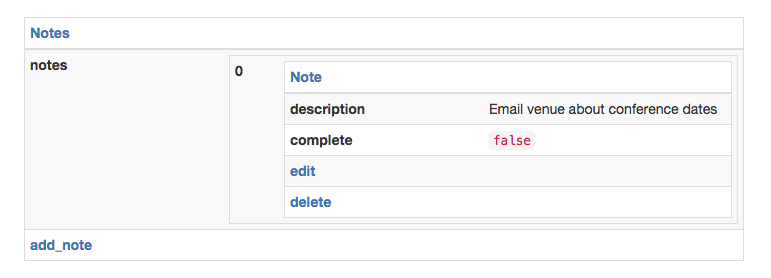

# Encoding

---

The **encoding layer** defines the mapping between [the document layer](document.md), and its byte string encoding.

Core API currently defines a JSON based encoding scheme, and an HTML encoding scheme.

Servers implementations are free to support and respond with either of these schemes. Server implementations MAY choose to use the client `Accept` header to determine which of the two representations to respond with.

---

## Core JSON encoding

A document is represented using the [JSON encoding][json]. In addition to the standard set of JSON primitives, Core JSON adds the following:

* Document. `{"_type": "document", ...}`
* Link. `{"_type": "link", ...}`
* Error. `{"_type": "error", ...}`

The top level element in a Core JSON response MUST either be a Document or an Error.

The media type for this scheme is: `application/vnd.coreapi+json`.

An example Core JSON encoded document is demonstrated below.

    {
        "_type": "document",
        "_meta": {
            "url": "/",
            "title": "Notes"
        },
        "notes": [
            {
                "_type": "document",
                "_meta": {
                    "url": "/1de153fe-6747-41d3-bc0e-d9d7d87e448a",
                    "title": "Note"
                },
                "complete": false,
                "description": "Email venue about conference dates",
                "delete": {
                    "_type": "link",
                    "action": "delete"
                },
                "edit": {
                    "_type": "link",
                    "action": "put",
                    "fields": [
                        {
                            "name": "description"
                        }, {
                            "name": "complete"
                        }
                    ]
                }
            }
        ],
        "add_note": {
            "_type": "link",
            "action": "post",
            "fields": [
                {
                    "name": "description",
                    "required": true
                }
            ]
        }
    }

### Document

**The Document primitive is represented using an object which includes a key-value pair of `"_type": "document"`.**

* Documents MAY include a `"_meta"` key. The value of this SHOULD be an object. If omitted, the default value is treated as an empty Object.

* The `"_meta"` object MAY include keys named `"url"` and `"title"`.

* Any other keys occurring in the Document `"_meta"` section SHOULD be ignored by clients.

* The value of the `"url"` field SHOULD be a string. This value is treated as relative to the URL of any parent containing document. When a document is loaded from the network then the URL of the top level document is treated as relative to the URL that the content was fetched from. If omitted the default value is treated as the empty string, relative to the URL of the parent containing document or network URL, as above.

* The value of the `"title"` field SHOULD be a string. If omitted, the default value is treated as the empty string.

* All other key-value pairs are treated as the document content.

### Link

**The Link primitive is represented using an object which includes a key-value pair of `"_type": "link"`.**

* Links MAY include keys named `"url"`, `"action"`, `"transform"`, and `"fields"`.

* Any other keys occurring in an Link SHOULD be ignored by clients.

* The value of the `"url"` field SHOULD be a string, and is treated as relative to the URL of the parent containing document. If omitted the default value is treated as the empty string, relative to the URL of the parent containing document.

* The value of the `"action"` field SHOULD be a string. If omitted value defaults to the empty string.

* The value of the `"transform"` field SHOULD be a string. If omitted value defaults to the empty string.

* The value of the `"fields"` field SHOULD be a list. If omitted the default value is the empty list.

*Link parameters:*

* Each element of the `"fields"` list SHOULD be an object. Elements that are not objects are ignored.

* An object item in the `"fields"` list SHOULD contain a key `"name"`. The value of this SHOULD be a string. If omitted, the object item is ignored.

* An object item in the `"fields"` list MAY include a key `"required"`. The value of this SHOULD be a boolean. If omitted the default value is `false`.

* An object item in the `"fields"` list MAY include a key `"location"`. The value of this SHOULD be a string. If omitted the default value is the empty string.

### Error

**The Error primitive is represented using an object which includes a key-value pair of `"_type": "error"`.**

* Error MAY include a `"_meta"` key. The value of this SHOULD be an object. If omitted, the default value is treated as an empty Object.

* The `"_meta"` object MAY include a key named `"title"`.

* Any other keys occurring in the Error `"_meta"` section SHOULD be ignored by clients.

* The value of the `"title"` field SHOULD be a string. If omitted, the default value is treated as the empty string.

* All other key-value pairs are treated as the error content.

* Errors SHOULD only occur as the top level element. Any Error occurring as a child element inside a Document, Object or Array SHOULD be ignored.

### Data primitives

**The standard JSON primitives are represented as usual.**

* These are Object, Array, String, Integer, Number, `true`, `false` and `null`.

### Handling unexpected types

* Several of the Object structures described above indicate a required type for an element. When the value type is not as expected, the value SHOULD be ignored, and the indicated default value used instead.

* Any Object with a `"_type"` key that is not `"document"`, `"link"` or `"error"` is invalid. The `"_type"` key and any `"_meta"` key are to be removed from the normal parse flow, and the element is to be treated by the client as a standard Object.

### Escaping reserved keys

The object keys `"_type"` and `"_meta"` are reserved, and should not be included in the standard parsing of key-value contents of Document or Object types.

Core JSON ensures that the reserved `"_type"` and `"_meta"` are still valid literal keys, by providing escaping and unescaping rules as detailed below.

#### Escaping reserved keys during encoding

When any object key matching the regular expression `/[\_]+(type|meta)/` is encountered, it MUST be escaped by pre-pending an additional underscore character.

#### Unescaping reserved keys during decoding

When any object key matching the regular expression `/_[\_]+(type|meta)/` is encountered, it MUST be unescaped by removing the leading underscore character.

### Canonical style

The following canonical style indicates a set of guidelines that server implementations or client libraries MAY choose to follow, in order to generate a consistent output format for the JSON encoding.

#### Key ordering

Clients MAY choose to order any Object or Document keys in their output, as follows.

* `"_type"`
* `"_meta"` (With `"url"` occurring before `"title"` in the child Object.)
* All keys with a value *that is not* a Link, ordered alphabetically.
* All keys with a value *that is* a Link, ordered alphabetically.

#### Omitting default values

Clients MAY choose to omit any values that are the default when encoding a document.

#### Using relative links

Clients MAY take advantage of the relative URL transformations made when parsing Documents and Links, in order to encode minimal URL outputs.

* The top level Document MUST include its URL value, without transformation.
* If a child Document or Link has the same scheme, host and port portion as its parent, it MAY omit those portions of the URL, and include only the path, query string and fragment identifier portion of the URL.
* If a child Document or Link has the the same URL as its parent, it may omit the URL entirely.

#### Indentation and spacing

Client MAY choose to use a concise style as the default. Using this style will ensure that no spacing or indentation is used between tokens.

Clients MAY choose to allow an optional verbose style. Using this style will ensure that ":" delimiters have a following whitespace, "," delimiters have no following whitespace, and elements are newline indented, with four space character indentation level.

---

## HAL encoding

*HAL services MUST expose their endpoints with the `application/hal+json` media type.*

Core API documents can be encoded in HAL, with a few limitations:

#### HAL does not supports parameter or action information on links.

When interacting with a HAL service using Core API, you'll need to explicitly
set any actions other than GET. For example, using the command line client:

    coreapi action add_note -a post -p description="A new todo note"

Additionally, parameters will not be included in the link descriptions displayed
by Core API documents.

#### Indexing by keys vs indexing by `rel` values.

HAL uses `rel` values to identify and index links and embedded documents,
whereas Core API uses the key in the document.

In order to handle this Core API maps between HAL `rel` values and roughly equivalent key values.
For example, if decoding a HAL document then the link's `curie` name will be as the key, if it exists.

#### Valid document structures.

HAL supports documents and links as top level items, where Core API supports
documents and links nested anywhere in the parent document.

This introduces some limitations on the valid document structures that Core API
can support in HAL representations.

#### Link help information.

Core API does not yet support help information being associated with links,
which HAL provides for.

---

## JSON Hyper-Schema

*JSON Hyper-Schema endpoints MUST use the `application/schema+json` media type.*

Core API can support decoding & interacting with JSON HyperaSchema endpoints.

The schema style is less expressive that true hypermedia, as it consists of a single
monolithic entry point. Calls to the endpoint typically result in data being returned
from the service, rather than a new hypermedia document. Nonetheless, using a Core API
client library to interact with a service using its schema definition is far more robust
and meaningful than constructing HTTP requests explicitly.

The additional benefit of schemas is that they can be created for existing APIs without
any internal changes being required. Furthermore, if clients load the schema definition
from disk, then no initial HTTP call to request the entrypoint is required.

---

## OpenAPI / Swagger

Core API can support decoding & interacting with OpenAPI / Swagger endpoints.

The following constraints currently exist, although future work is planned on each of these:

* Core API does not yet support file upload or download.
* Core API does not yet support encodings other than JSON for request data.
* Core API does not yet support choosing delimiters for lists in query parameters.
* Core API does not yet support help information being associated with links.

---

## HTML encoding

The HTML encoding for Core API allows servers to respond in a way that allows for direct Web browser based interaction with the API.

This encoding is primarily intended for usage in Web browsers, but MAY also be parsed as a machine readable format.

Elements defined in the HTML encoding specification may include extra classes and attributes, and may be enclosed inside any parent HTML structure. This allows APIs to customize the style with which the browser based interaction is presented.

In order to to be properly supported the rendered HTML should include javascript and styling in order to allow the user to perform any available transitions included in the document.

The media type for this scheme is `text/html`.

The [python client library](https://github.com/core-api/python-client) can be taken as the canonical example for implementing an HTML rendering.

### Document

**Documents are encoded as `table` elements with a `coreapi-document` class.**

The document name and URL are represented in a single row in the `thead` element.

The  `thead` element, SHOULD enclose a single `tr` element, which SHOULD enclose a single `th` element. This element contains the document name and URL. The name and URL SHOULD be included as an `a` element, with the `href` indicating the URL, and the element text indicating the document name.

The document content is represented as the `<tbody>` element enclosing multiple `<tr>` elements.

Each data item in the document is represented as a row, which SHOULD include a single `<th>` and `<td>` element. The `<th>` element SHOULD contain the key of the item, and the `<td>` element SHOULD contain the value of the item.

Each link item in the document is represented as a row, which SHOULD include a single `<th>` element, containing the link.

### Objects

**Objects are encoded as `<table>` elements with a `coreapi-object` class.**

The object content is represented as the `<tbody>` element enclosing multiple `<tr>` elements.

Each data item in the object is represented as a row, which SHOULD include a single `<th>` and `<td>` element. The `<th>` element SHOULD contain the key of the item, and the `<td>` element SHOULD contain the value of the item.

Each link item in the object is represented as a row, which SHOULD include a single `<th>` element, containing the link.

### Arrays

**Documents are encoded as `<table>` elements with a `coreapi-array` class.**

The array content is represented as the `<tbody>` element enclosing multiple `<tr>` elements.

Each row SHOULD containing a single `<th>` element, with a textual context indicating the array index for that row.

Each row SHOULD contain a single `<td>` element, containing the item at that point in the array.

### Links

**Links are encoded as `<a>` elements, with a `coreapi-link` class.**

The key under which the Link is contained by its parent Object or Document SHOULD be contained in the text content of the element.

The URL of the Link SHOULD be contained in the `href` value of the element.

The action value of the Link SHOULD be include in a `data-action` attribute.

The transform value of the Link SHOULD be include in a `data-transform` attribute.

The fields for the Link SHOULD be included in a `data-fields` attribute, which should be a whitespace separated list of the field names.

### Data primitives

**Data primitives are encoded as `<code>` and `` elements.**

The `true`, `false` and `null` primitives SHOULD be enclosed within a `<code>` element, using their textual name as the content. For example `<code>true</code>`.

Number and integer primitives SHOULD be enclosed within a `<code>` element.

String primitives SHOULD be enclosed within a `` element.
The newline character, `'\n'`, MAY be replaced with a ` ` element.

### Errors

**Errors are encoded as `<ul>` elements, with a `coreapi-error` class.**

Each message in the error SHOULD be included as a `<li>` element, with the text of the element containing the message value.

[json]: http://www.json.org
